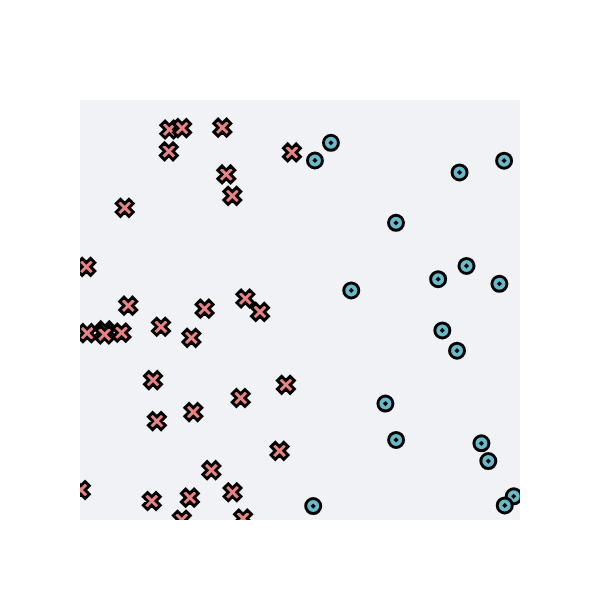

# testing

# MiniTorch Module 0

* Docs: https://minitorch.github.io/

* Overview: https://minitorch.github.io/module0/module0/

## Dataset Visualization
Below is an image of the dataset used for model training.

### Model Parameters
- **Dataset** = Simple
- **Number of points** = 50
- **Parameter: linear.weight_0_0** = -0.71  
- **Parameter: linear.weight_1_0** = -0.09  
- **Parameter: linear.bias_0** = 0.54  

## Result
- **Epoch** = 0  
- **Loss** = 0  
- **Correct** = 0  
